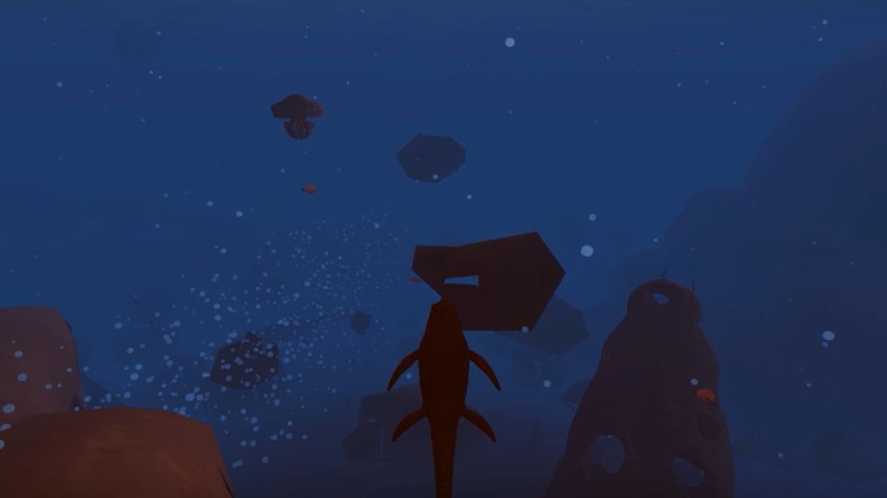
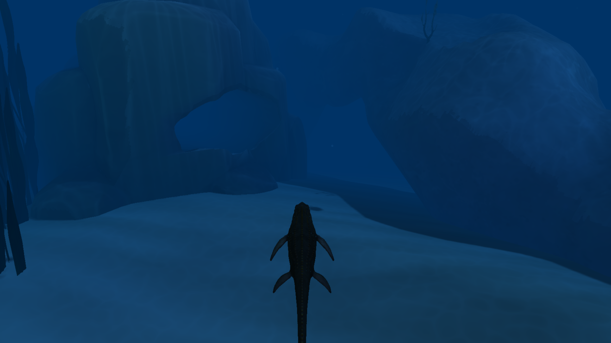
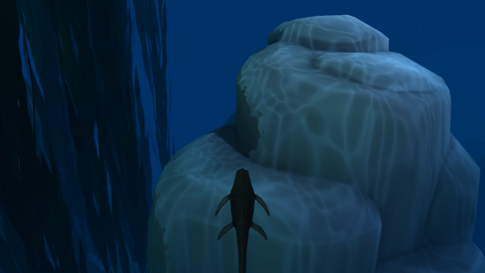
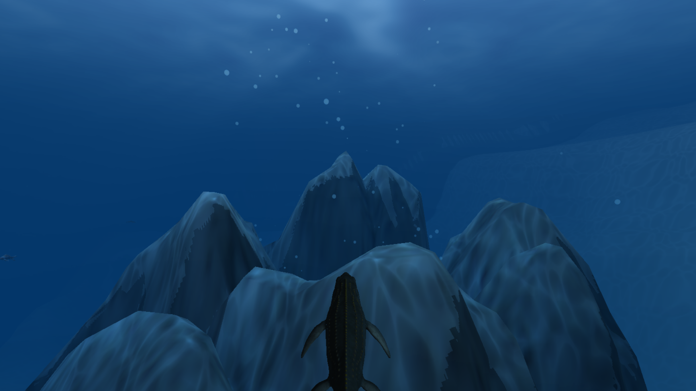
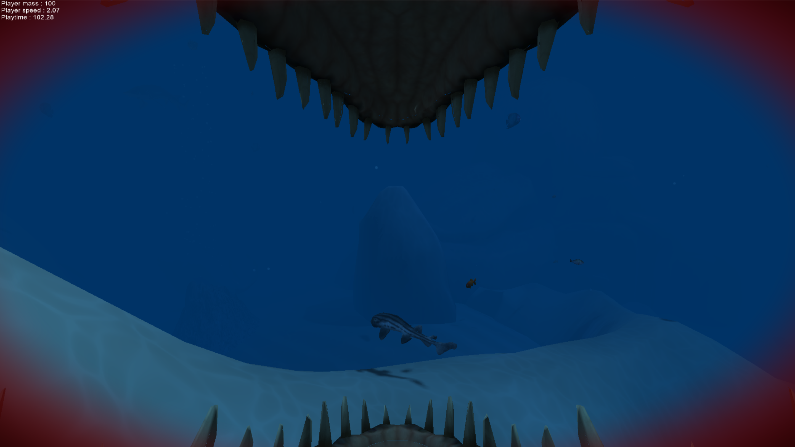
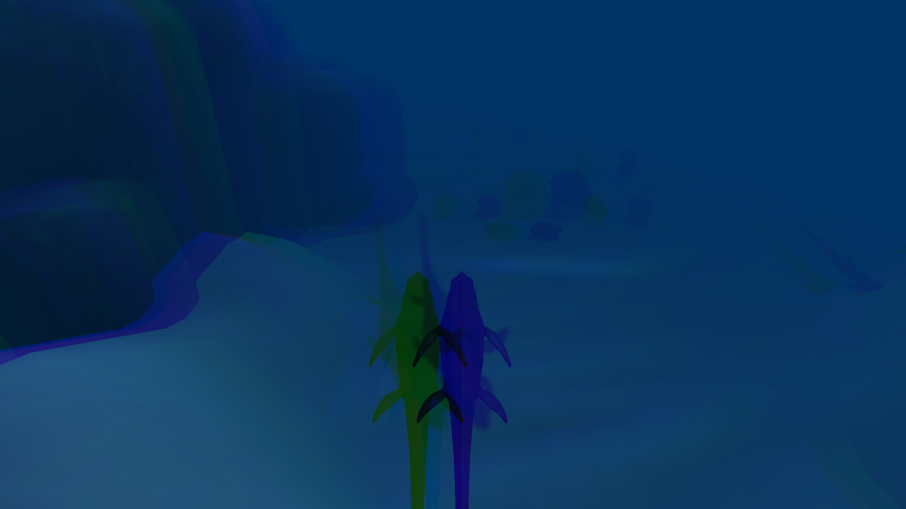
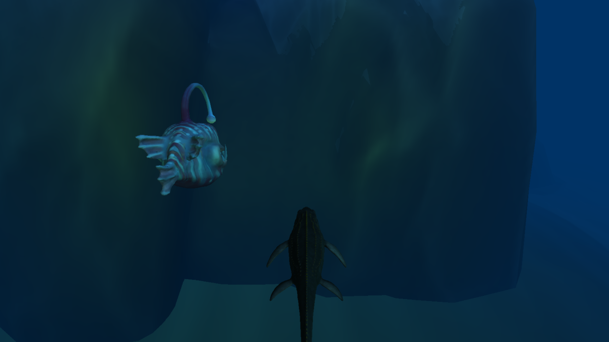
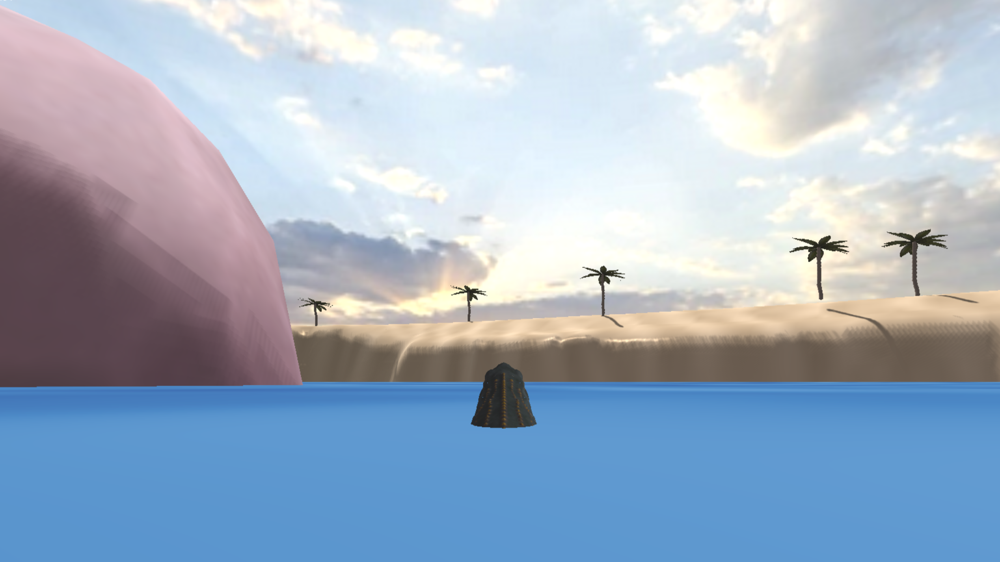
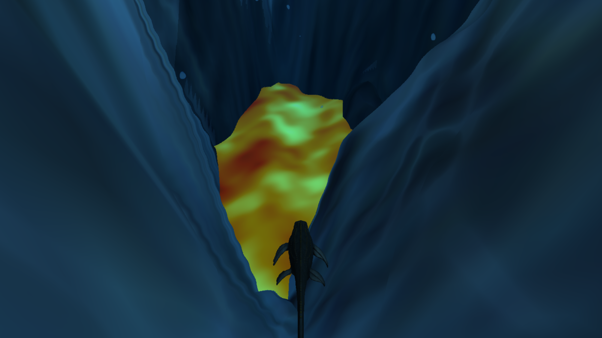

# Need4Fish :fish::shark:

&emsp;_Need4Fish_ est un jeu de course contre la montre effréné dans lequel vous incarnez un mosasaure juvénile abandonné par sa mère avec un seul objectif en tête : se venger.<br>
Pour cela, vous devez manger d'autres poissons afin de grandir et atteindre le sommet de la chaîne alimentaire et dévorer celle qui vous a jadis abandonné.

_Need4Fish_ est notre jeu de course pour la session d'hivers 2025 au DDJV et fonctionne grâce à _FishEngine_, notre moteur de rendu maison.

## Développé par

- Sylvain Brunet (brus4186)
- Thierry Demers-Landry (demt6496)
- Alexandre Gagnon (gaga1716)
- Nell Truong (trun8382)

## Étapes à suivre pour build le jeu

1. Dans le répertoire "FishEngine", exécuter :
   ```bash
   ./build.bat
   ```
2. Aller faire un café (~5min de build pour Assimp + Jolt)
3. Lancer la solution "FishEngine.sln"
4. Choisir "Need4Fish" comme projet de démarrage
5. Lancer le projet en Release

Attention, un chemin de dossier trop long peut provoquer des erreurs !

## Contrôles

- ESC pour mettre le jeu en pause (et récupérer la souris) ou sortir de pause
- Maintenir R pour redémarrer la partie

- Mouvements de la souris pour pivoter dans la direction désirée
- W et S pour avancer et reculer
- A et D pour "strafe" à gauche et à droite

- Roulette de la souris pour ajuster le zoom de la caméra
- ALT + Entrée pour activer/désactiver le mode pleine écran

## Boucle de jeu (Gameplay loop)

### Boucle principale
- L'objectif est de manger le grand mosasaure à l'extérieur du monticule
- Il faut manger d'autres poissons plus petits avant, sinon c'est le grand mosasaure qui VOUS mange
- Pour manger : simplement entrer en contact avec les autres êtres vivants.
- Si on a plus de masse, l'autre disparaît et on gagne en masse.
- S'il y a égalité, l'autre se fait "pousser".
- Si l'autre a plus de masse, l'écran de fin de jeu apparaît et il faut recommencer ('R').

- Dans le moment, il n'est pas possible de savoir si on a plus de masse que l'autre avant d'entrer en contact.
- Le joueur grandit lorqu'il mange des proies.

### Apocalypse

Si le joueur patiente trop à se venger, l'apocalypse arrive. Cet évènement arrive à partir d'un temps aléatoire entre 3 et 4 minutes pour mettre fin à l'existence des dinosaures.

Durant cet évènement, des météorites tombent du ciel, l'ambiance devient rouge, le soleil bouge, s'assombrit et la mère se met en route pour vous dévorer.



## Techniques de rendu

### Fog & atténuation

Afin de donner à la scène son ambiance aquatique, des shaders de brouillard (fog) et d'atténuation (Beer-Lambert) sont appliqués pour lui donner son ambiance bleutée.

L'intensité du brouillard et de l'atténuation dépendent de la profondeur à laquelle se trouve le joueur.



### Caustiques (Caustics)

Les caustiques permettent d'ajouter à l'ambiance aquatique de la scène.

Tout comme le brouillard et l'atténuation, l'intensité des caustiques dépend de la profondeur à laquelle se trouve le joueur.



### Billboards

Nous avons utilisé des panneaux (billboards) afin de rendre des bulles pour notre jeu. Les billboards sont la base de notre _système de particules_.



### Texture animées

Afin de rendre la surface de l'eau et de la lave, un shader "génère" des textures animées. Donnant l'effet d'eau et de lave qui bougent.

### Vignette

La vignette donne un effet de vision _ensanglantée_ lorsque le joueur passe à la première personne.



### Abbération Chromatique

Le poisson globe poissons-globes étant connus pour posséder de puissantes neurotoxines manger un poisson globe donne au joueur un effet de maladie ou de drogue représenté par l'abbération chromatique.



### Flou Radial (Radial blur)

Le flou radial permet de donner l'impression de "God rays" ou rayons divins, qui apparaissent lorsqu'on regarde vers la surface de l'eau.


### Lumières

Notre moteur de rendu supporte deux types de lumière:

- Directionnelles:
  - Utilisée pour représenter le soleil et éclairer l'ensemble de notre scène
- Point:
  - Utilisée pour les crystaux lumineux de la caverne
  - Utilisée pour la lumière du poisson-lanterne.

Lumière du poisson-lanterne éclairant les rochers:



### Cartes d'ombres (Shadow maps)

Pour la gestion des ombres, nous avons fait usage de shadow maps.


### Skybox

Le ciel est fait grâce à l'utilisation d'une boîte à ciel.



### Distorsion

Afin de représenter la chaleur extrême de la lave, un effet de distorsion est appliqué autour de la lave.



### Mesures de performance

Afin d'améliorer les performances de notre jeu, nous avons implémenté plusieurs mesures dans notre engin de rendu:

- Backface culling (Élimination des faces arrières), activable ou non au choix selon les objets. La surface de l'eau n'en a pas besoin par exemple.
- Frustum culling (Élimination hors du champs de vue): les objets en dehors du champs de vue n'ont pas besoin d'être rendus.
- Instancing: les particules, qui sont présentes en grand nombres n'ont pas besoin d'être dessinées individuellement, on les regroupe alors dans un même appel de dessin, afin d'éviter de passer un grand temps CPU à faire _Draw calls_ au GPU.

## Étapes à suivre pour cloner (devs)

1.  ```bash
    git clone -b develop --recurse-submodules https://github.com/SylvainBRUNET37/FishEngine.git
    ```
2.  Exécuter la commande :
    ```bash
    ./build.bat
    ```

## Credits & remerciements

Merci aux artistes dont nous avons utilisé les assets pour créer notre jeu.

- [Coral fish](https://sketchfab.com/3d-models/coral-fish-ea8d002da75a4dd09658b962722279c5) by polyplant3D (Licence: CC Attribution)
- [Basic fish](https://sketchfab.com/3d-models/anglerfish-0047a66766394a018fdab16279fee694) by Yimit (Licence: )CC Attribution
- [Anglerfish](https://sketchfab.com/3d-models/anglerfish-0047a66766394a018fdab16279fee694) by Karstart (Licence: CC Attribution)
- [Mosasaure](https://sketchfab.com/3d-models/mosasaurus-4a1feecff6c7468b8c07ba0ad439e0e0) by (Licence: CC Attribution-NonCommercial)
- [Méduse "Jellyfish_003"](https://skfb.ly/6VRXn) by n- (Licence: CC Attribution)
- [Statue](https://skfb.ly/pyOO8) by Global Digital Heritage and GDH-Afrika (Licence: CC Attribution-NonCommercial)
- [Texture Blue_marble_pxr128](https://renderman.pixar.com/pixar-one-twenty-eight) by (Licence: CC Attribution 4.0 International)
- [Crocodile Skull](https://sketchfab.com/3d-models/crocodile-skull-86f6a2b477284fd1ab4e544e2846c014) by toaste (Licence: CC Attribution)
- [Claret Tall Seaweed](https://sketchfab.com/3d-models/claret-tall-seaweed-6a07131b52b34d8992861d3c3ba82a29) by Ben Laret (Licence: CC Attribution)
- [Stone Pack](https://sketchfab.com/3d-models/stone-pack-f3e0a67b9ca243b09119177649f21e17) by ashkan.fancy (Licence: CC Attribution)
- [Seashell](https://sketchfab.com/3d-models/seashell-410be9cdc3d84f6a9f139189309b4891) by TraianDumbrava (Licence: CC Attribution)
- [sbfbbr - Kelpwall](https://sketchfab.com/3d-models/sbfbbr-kelpwall-4a3db8bae76e4c3aa4c0a33e7d67b5d5) by Romyblox1234! (Licence: CC Attribution)
- [ARK: Survival Evolved Helicoprion]() by AllThingsSaurus (Licence: CC Attribution)
- [Fan Coral Med](https://sketchfab.com/3d-models/fan-coral-med-f438cf7717284f9ea70b8fbff89dc836) by Valery.Li (Licence: CC Attribution)
- [Soft Coral Set](https://sketchfab.com/3d-models/soft-coral-set-256355f15fcb4095af17b75ae572bff0) by Kanna-Nakajima (Licence: CC Attribution)
- [Pyjama Shark](https://sketchfab.com/3d-models/pyjama-shark-free-900f2c61c15f41cbb38d65f714a33ed2) by Nyilonelycompany (Licence: Free Standard)
- [Low Poly Crystals](https://sketchfab.com/3d-models/low-poly-crystals-8c05ee81a9724e9d8b7bacb340385896) by Geraldo Pratama Wahyu Teddy (Licence: CC Attribution)
- [Kloppenheim 06 (Pure Sky)](https://polyhaven.com/a/kloppenheim_06_puresky) by Greg Zaal & Jarod Guest (Licence: CC0)
- [Atlantic Sturgeon](https://sketchfab.com/3d-models/atlantic-sturgeon-ac7a0b99c8c64c65802e8a3d3fa12c11) by zoofun (Licence: CC Attribution)
- [Cheese Wheel](https://sketchfab.com/3d-models/cheese-wheel-a13f5f718be8456c8f3b550ad5506732) by Jay (Licence: CC Attribution)
- [coconut turtle!](https://sketchfab.com/3d-models/coconut-turtle-a805996392384fde999643c41cc2a2f8) by Lizzy Koopa (Licence: CC Attribution)
- [Koi Fish](https://sketchfab.com/3d-models/koi-fish-236859b809984f52b70c94fd040b9c59) by 7PLUS (Licence: CC )Attribution
- [Kelp L](https://sketchfab.com/3d-models/kelp-l-611e0bdd8b5c4530b436d4b5f5a96b35) by stefanorivera (Licence: CC Attribution)
- [Real Time Ready seashells scan](https://sketchfab.com/3d-models/real-time-ready-seashells-scan-181618b07e73490188f58ce9cf6cfefa) by shaunwho (Licence: CC Attribution)
- [Discus 3](https://sketchfab.com/3d-models/discus-3-e284e187712e4e00b001ce773398ad51) by Comitre (Licence: CC Attribution)
- [Gold Fish](https://sketchfab.com/3d-models/gold-fish-fc655111af5b49bf84722affc3ddba00) by Shahbriar Shahrabi (Licence: CC Attribution)
- [PSX Tropical Pack V1](https://sketchfab.com/3d-models/psx-tropical-pack-v1-831f5ce303354977a6acb695571ac01b) by PROJEKTSANSSTUDIOS (Licence: CC Attribution)
