# FishEngine & Need4Fish :fish::shark:

Need4Fish is a paced 3D race against the clock game made with it's homemade 3D game engine. In Need4Fish, you play as a juvenile mosasaur that was abandoned by their mother with one only goal: vengeance. To do that, you'll need to climb the food chain and become the new apex predator.

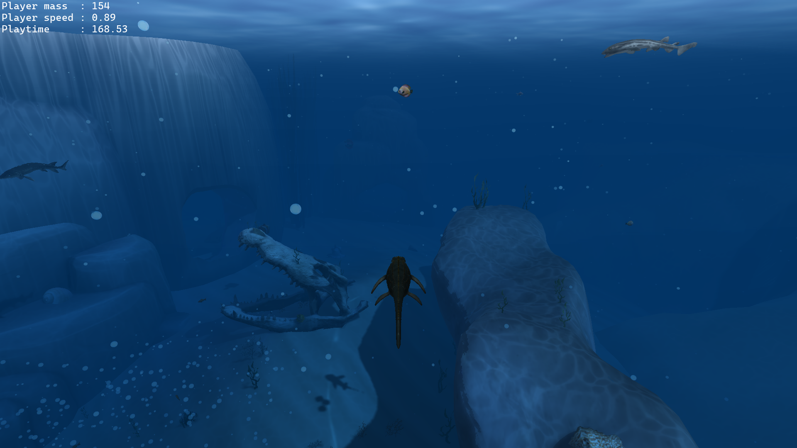

## Contributors

- Sylvain Brunet (brus4186)
- Thierry Demers-Landry (demt6496)
- Alexandre Gagnon (gaga1716)
- Nell Truong (trun8382)

## Learnings

- Real-time rendering techniques and shader programming
- Profiling and CPU performances optimization
- Spatial optimizations (frustum culling, backface culling)
- Graphics debugging and frame analysis using RenderDoc
- Utilisation of a physics engine
- Entity Component System (ECS)
- 3D game engine architecture
- Data oriented design
- Asset integration
- Gameplay features

## Controls

- ESC to pause the game or resume
- Hold R to restart the game
- Mouse movement to rotate in the desired direction
- W and S to move forward and backward
- A and D to strafe left and right
- Mouse wheel to adjust camera zoom
- ALT + Enter to toggle fullscreen mode

## Gameplay

### Main Loop

- The objective is to eat the large mosasaur
- You must eat smaller fish first; otherwise, the large mosasaur will eat YOU
- To eat: simply make contact with other living beings
  - If you have more mass, the other disappears and you gain mass
  - If there is a tie, the physics is applied
  - If the other has more mass, the game over screen appears
- The player grows as they eat prey

### Physics Mechanics

- Player movement and control handling
- Collision detection and response with multiple collider types
- Dynamic box scaling after consuming fishes
- Jellyfish entities that repel the player on contact
- Seaweed areas that apply movement slow-down effects
- Water currents and geysers that apply movement speed-up effects
- Floating and sinking mechanics with buoyancy effects

### Camera

We support both first-person and third-person camera modes.

### Apocalypse

If the player waits too long to take revenge, the apocalypse begins. This event triggers at a random time between 3 and 4 minutes to bring an end to the existence of the dinosaurs. During this event, meteors fall from the sky, the atmosphere turns red, the sun moves and darkens, and the mother move off to devour you.

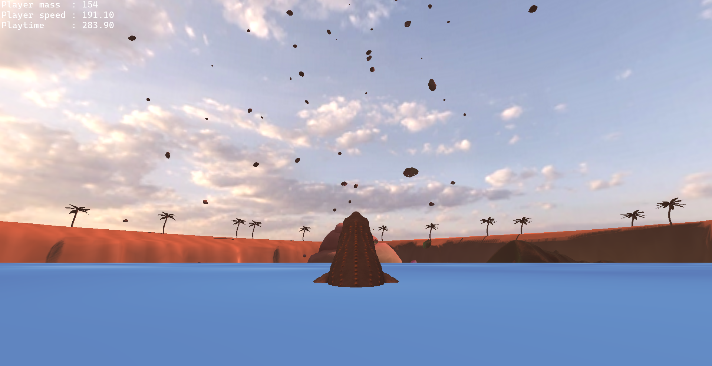
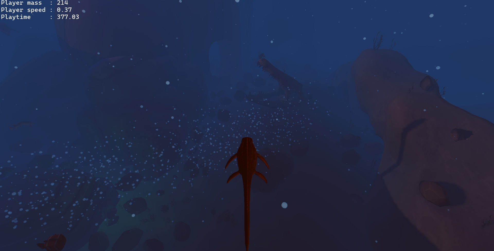

## Rendering Techniques 

### Fog & Attenuation

To give the scene its aquatic atmosphere, fog and attenuation (Beer–Lambert law) shaders are applied to create a bluish ambiance. The intensity of the fog and attenuation depends on the depth at which the player is located.

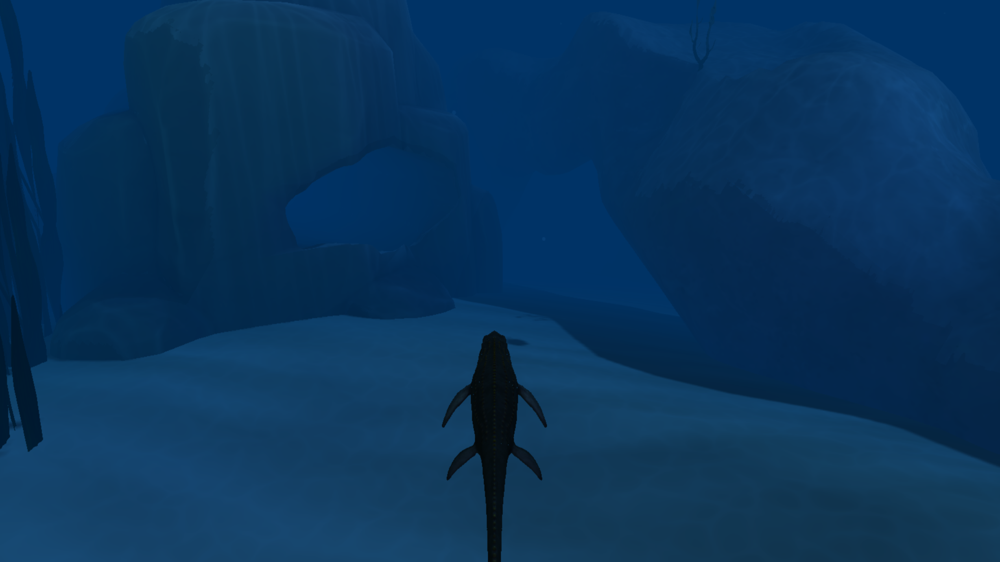

### Caustics

Caustics help enhance the aquatic atmosphere of the scene. Just like fog and attenuation, the intensity of the caustics depends on the depth at which the player is located.

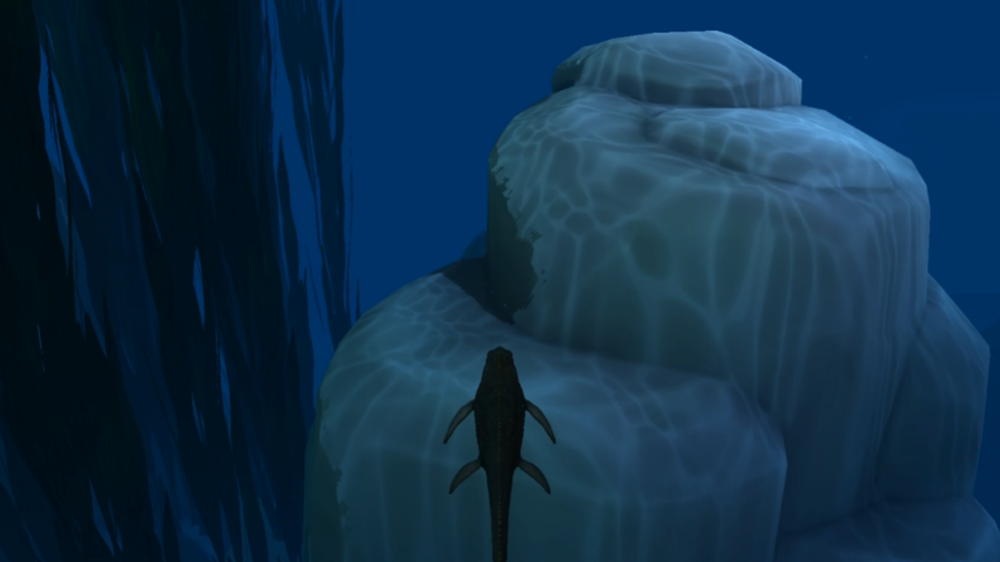

### Billboards

We used billboards to render bubbles in our game. Billboards are the foundation of our _particle system_.

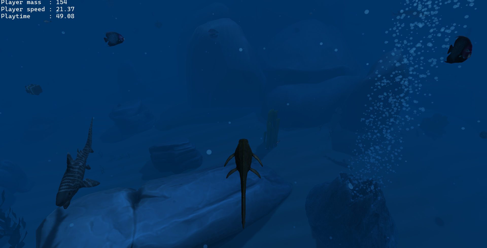

### Animated Textures

To render the surface of water and lava, a shader "generates" animated textures, giving the effect of moving water and lava.

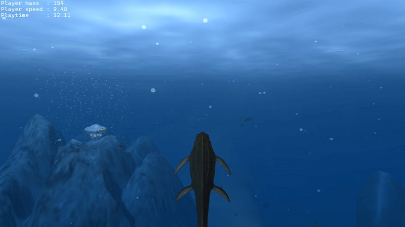

### Vignette

The vignette creates a _bloodshot vision_ effect when the player gets close to a larger creature (greater mass than the player), providing a brief reaction window to avoid being eaten and losing the game.

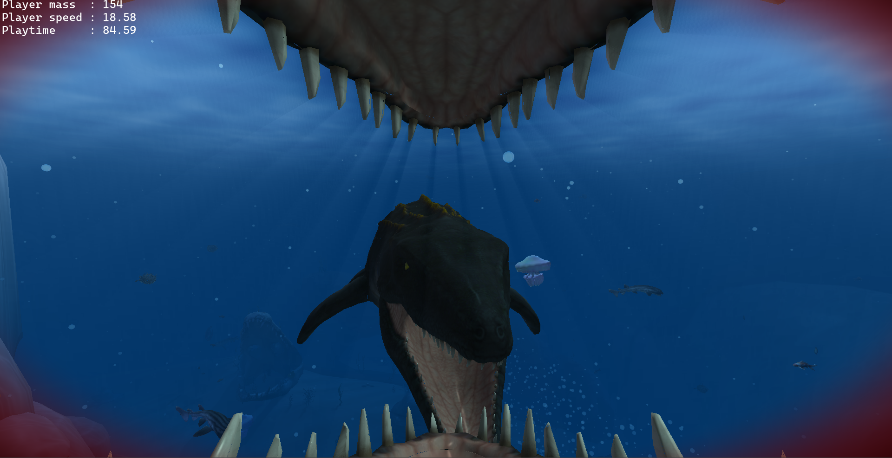

### Chromatic Aberration

Since pufferfish are known to possess powerful neurotoxins, eating a pufferfish gives the player a sickness or drug-like effect represented by chromatic aberration.

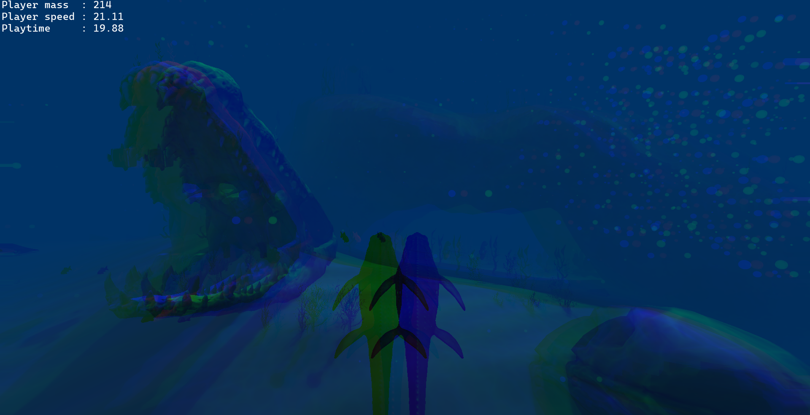

### Radial Blur

Radial blur creates the impression of “God rays” or divine rays, which appear when looking toward the surface of the water.

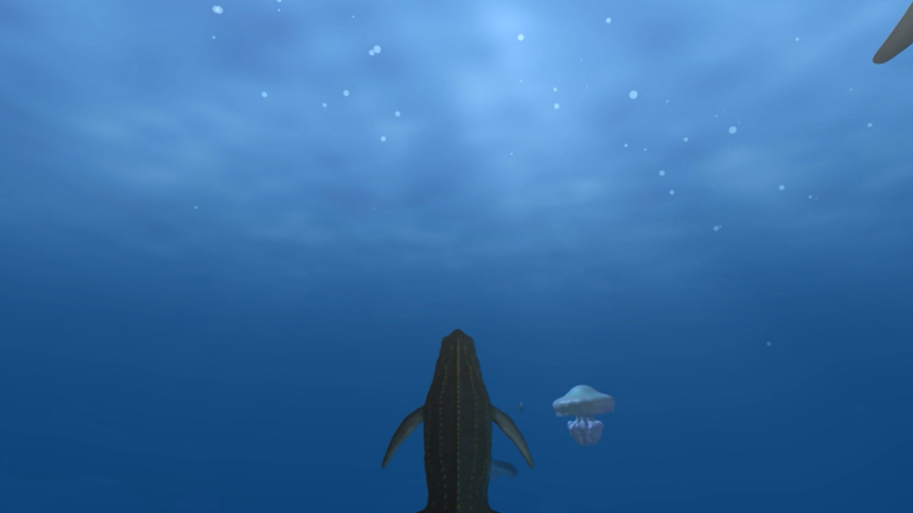
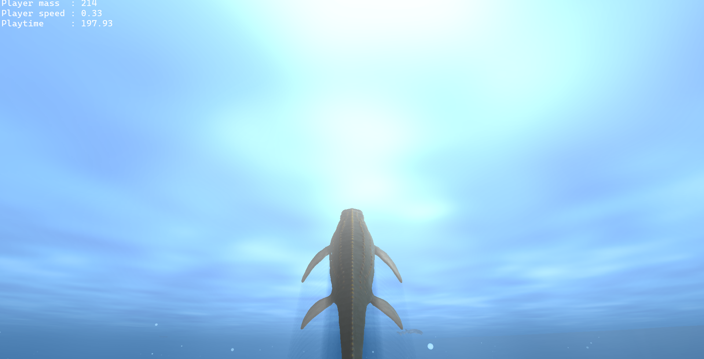

### Lighting

Our rendering engine supports two types of lights:
- Directional:
  - Used to represent the sun and illuminate the entire scene
- Point:
  - Used for the glowing crystals in the cave
  - Used for the light of the anglerfish

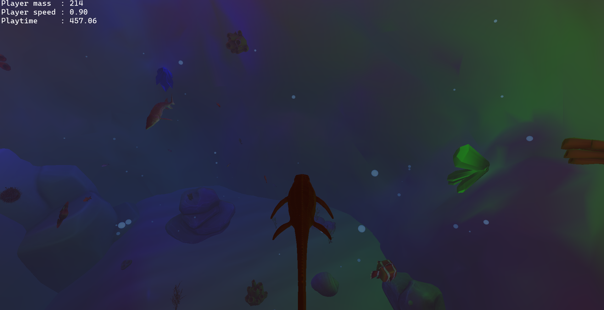

### Shadow Maps

For shadow management, we made use of shadow maps.

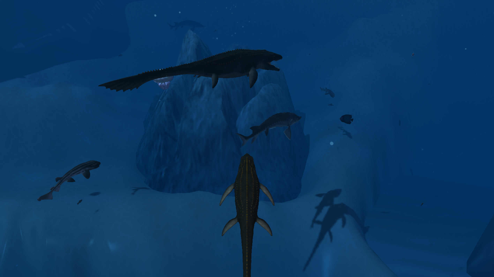

### Skybox

The sky is created using a skybox.

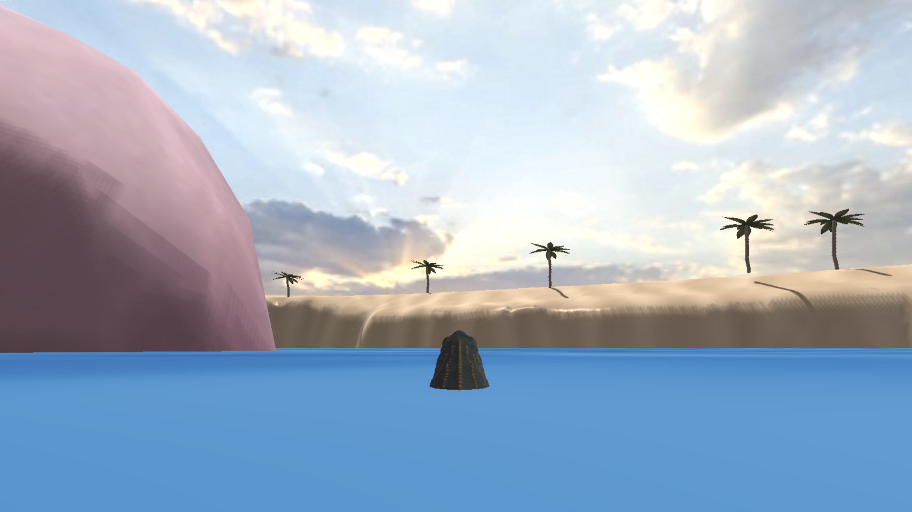

### Distortion

To represent the extreme heat of the lava, a distortion effect is applied around the lava.

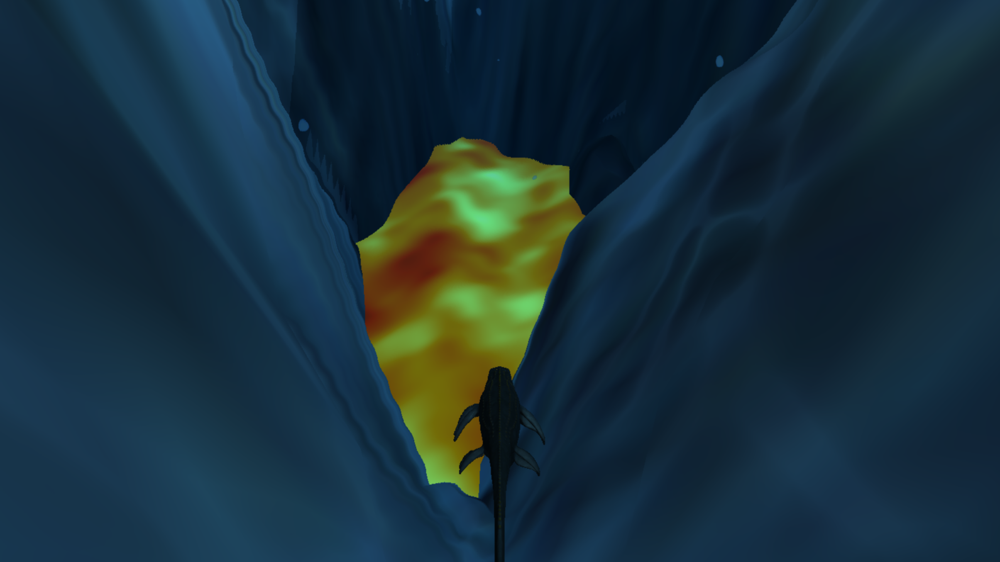

## Performance

### Test Environment

The game's performance was evaluated on the following configuration:

- Processor: 11th Gen Intel® Core™ i7-11800H @ 2.30 GHz (8 cores / 16 threads)
- Memory: 32 GB DDR4
- Graphics card: NVIDIA GeForce RTX 3070 (Laptop)

The analyses were performed using the Visual Studio profiler as well as Intel VTune Profiler for more in-depth analysis.

## Initialization

When loading the scene, the approximate CPU usage is distributed as follows:

- **30%**: texture loading  
- **17%**: scene (.glb) loading via the *Assimp* library  
- **9%**: render context creation (DirectX 11)  
- **8%**: shader compilation  
- **8%**: parsing of scene entity metadata for assigning components to entities  


## Memory and Cache

Memory behavior analysis shows good cache efficiency, with only **0.04%** of memory accesses resulting in *cache misses*.


## GPU Usage

The GPU is very lightly used during game execution. This is a small game, so this behavior is fairly normal.


## CPU Usage

The CPU spends a large portion of its time waiting. This is a small game, so this behavior is fairly normal.

However, when considering only the time spent actively executing, the main CPU costs come from:

- The particle system  
- Entity iteration  
- Text rendering  


Separating particle-type entities from other entities would have reduced the overhead caused by unnecessary iteration over them by other systems (rendering, physics, etc.).

In addition, the *gdiplus* library is not well suited for real-time text rendering. Using a more specialized technology would have reduced this cost.

Particle rendering also performs avoidable memory copies, which leads to performance loss.

Finally, cache usage is suboptimal in the function handling particle movement and lifetime. Approximately one third of the program's *LLC misses* originate from this function.


## Metrics

- **CPI (Cycles Per Instruction)**: 1.197  
- **Branch misprediction rate**: 1.33%

These values are acceptable, and there does not appear to be any major issue with branch prediction or the CPU pipeline.


## Implemented Optimizations

To improve the overall performance of the game, several optimizations were implemented:

- **Entity Component System (ECS)**: architecture designed for better memory locality and efficient cache usage
- **Backface culling**: removal of back-facing polygons, enabled depending on the object type (disabled for the water surface for example)
- **Frustum culling**: exclusion of objects outside the camera's view frustum from rendering
- **Instancing**: grouping particles into a reduced number of draw calls to limit the CPU cost of *draw calls*
- **GPU billboarding**: sprite orientation to face the camera is computed on the GPU, as it was less heavily loaded than the CPU

## Steps to Build the Game

1.  ```bash
    git clone -b develop --recurse-submodules https://github.com/SylvainBRUNET37/FishEngine.git
    ```
2.  Execute the command:
    ```bash
    ./build.bat
    ```

## Credits & Acknowledgements

Thanks to the artists whose assets we used to create our game.

- [Coral fish](https://sketchfab.com/3d-models/coral-fish-ea8d002da75a4dd09658b962722279c5) by polyplant3D (Licence: CC Attribution)
- [Basic fish](https://sketchfab.com/3d-models/anglerfish-0047a66766394a018fdab16279fee694) by Yimit (Licence: )CC Attribution
- [Anglerfish](https://sketchfab.com/3d-models/anglerfish-0047a66766394a018fdab16279fee694) by Karstart (Licence: CC Attribution)
- [Mosasaure](https://sketchfab.com/3d-models/mosasaurus-4a1feecff6c7468b8c07ba0ad439e0e0) by (Licence: CC Attribution-NonCommercial)
- [Méduse "Jellyfish_003"](https://skfb.ly/6VRXn) by n- (Licence: CC Attribution)
- [Statue](https://skfb.ly/pyOO8) by Global Digital Heritage and GDH-Afrika (Licence: CC Attribution-NonCommercial)
- [Texture Blue_marble_pxr128](https://renderman.pixar.com/pixar-one-twenty-eight) by (Licence: CC Attribution 4.0 International)
- [Crocodile Skull](https://sketchfab.com/3d-models/crocodile-skull-86f6a2b477284fd1ab4e544e2846c014) by toaste (Licence: CC Attribution)
- [Claret Tall Seaweed](https://sketchfab.com/3d-models/claret-tall-seaweed-6a07131b52b34d8992861d3c3ba82a29) by Ben Laret (Licence: CC Attribution)
- [Stone Pack](https://sketchfab.com/3d-models/stone-pack-f3e0a67b9ca243b09119177649f21e17) by ashkan.fancy (Licence: CC Attribution)
- [Seashell](https://sketchfab.com/3d-models/seashell-410be9cdc3d84f6a9f139189309b4891) by TraianDumbrava (Licence: CC Attribution)
- [sbfbbr - Kelpwall](https://sketchfab.com/3d-models/sbfbbr-kelpwall-4a3db8bae76e4c3aa4c0a33e7d67b5d5) by Romyblox1234! (Licence: CC Attribution)
- [ARK: Survival Evolved Helicoprion]() by AllThingsSaurus (Licence: CC Attribution)
- [Fan Coral Med](https://sketchfab.com/3d-models/fan-coral-med-f438cf7717284f9ea70b8fbff89dc836) by Valery.Li (Licence: CC Attribution)
- [Soft Coral Set](https://sketchfab.com/3d-models/soft-coral-set-256355f15fcb4095af17b75ae572bff0) by Kanna-Nakajima (Licence: CC Attribution)
- [Pyjama Shark](https://sketchfab.com/3d-models/pyjama-shark-free-900f2c61c15f41cbb38d65f714a33ed2) by Nyilonelycompany (Licence: Free Standard)
- [Low Poly Crystals](https://sketchfab.com/3d-models/low-poly-crystals-8c05ee81a9724e9d8b7bacb340385896) by Geraldo Pratama Wahyu Teddy (Licence: CC Attribution)
- [Kloppenheim 06 (Pure Sky)](https://polyhaven.com/a/kloppenheim_06_puresky) by Greg Zaal & Jarod Guest (Licence: CC0)
- [Atlantic Sturgeon](https://sketchfab.com/3d-models/atlantic-sturgeon-ac7a0b99c8c64c65802e8a3d3fa12c11) by zoofun (Licence: CC Attribution)
- [Cheese Wheel](https://sketchfab.com/3d-models/cheese-wheel-a13f5f718be8456c8f3b550ad5506732) by Jay (Licence: CC Attribution)
- [coconut turtle!](https://sketchfab.com/3d-models/coconut-turtle-a805996392384fde999643c41cc2a2f8) by Lizzy Koopa (Licence: CC Attribution)
- [Koi Fish](https://sketchfab.com/3d-models/koi-fish-236859b809984f52b70c94fd040b9c59) by 7PLUS (Licence: CC )Attribution
- [Kelp L](https://sketchfab.com/3d-models/kelp-l-611e0bdd8b5c4530b436d4b5f5a96b35) by stefanorivera (Licence: CC Attribution)
- [Real Time Ready seashells scan](https://sketchfab.com/3d-models/real-time-ready-seashells-scan-181618b07e73490188f58ce9cf6cfefa) by shaunwho (Licence: CC Attribution)
- [Discus 3](https://sketchfab.com/3d-models/discus-3-e284e187712e4e00b001ce773398ad51) by Comitre (Licence: CC Attribution)
- [Gold Fish](https://sketchfab.com/3d-models/gold-fish-fc655111af5b49bf84722affc3ddba00) by Shahbriar Shahrabi (Licence: CC Attribution)
- [PSX Tropical Pack V1](https://sketchfab.com/3d-models/psx-tropical-pack-v1-831f5ce303354977a6acb695571ac01b) by PROJEKTSANSSTUDIOS (Licence: CC Attribution)
- [Feather Fish](https://sketchfab.com/3d-models/feather-fish-e6c3adec1dc34e3297d5f10c23147cb1) by gavinpgamer1 (Licence: CC Attribution)
- [Sacabambaspis fish (Meme fish)](https://sketchfab.com/3d-models/sacabambaspis-fish-meme-fish-ee2ed83b2eb84968bb7a8eb597a4d958) by Aiden829 (Licence: CC Attribution)
- [Fish Pet - 1 - Ocellaris clownfish Cubius](https://sketchfab.com/3d-models/fish-pet-1-ocellaris-clownfish-cubius-30b46c26b48c4359a7aa30dde185e4fb#download) by POLYTRICITY (Licence: CC Attribution)