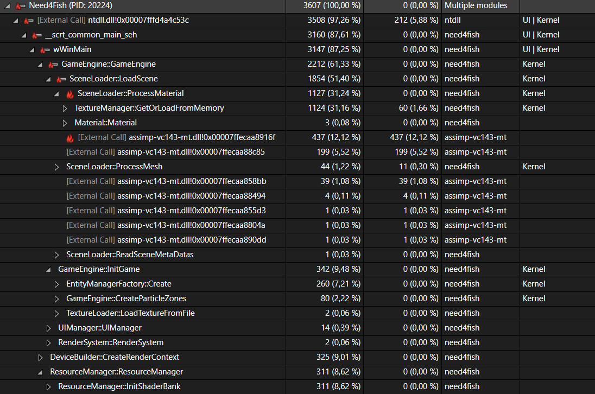
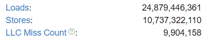
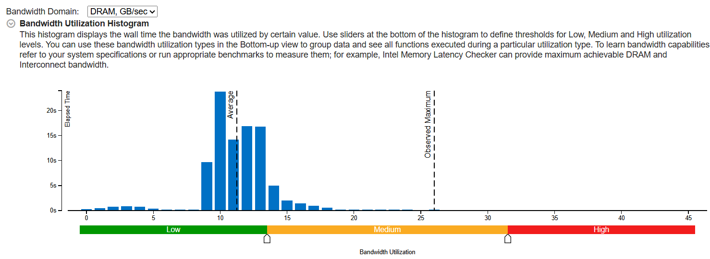
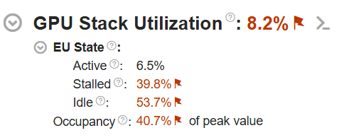
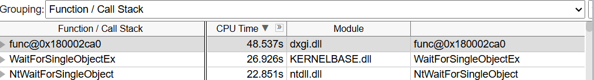
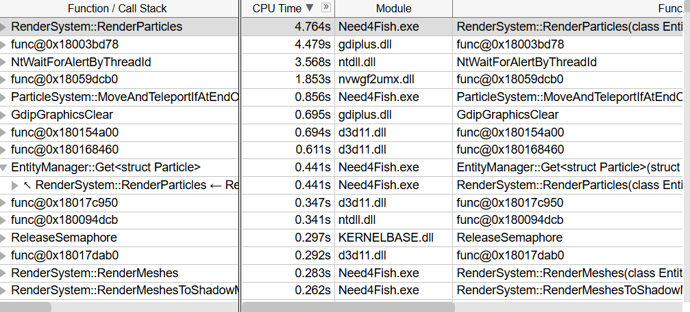
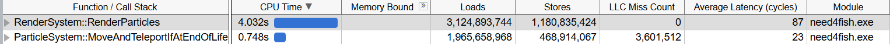
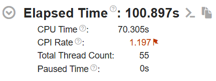
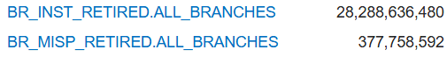

## Test Environment

The game's performance was evaluated on the following configuration:

- Processor: 11th Gen Intel® Core™ i7-11800H @ 2.30 GHz (8 cores / 16 threads)
- Memory: 32 GB DDR4
- Graphics card: NVIDIA GeForce RTX 3070 (Laptop)

The analyses were performed using the Visual Studio profiler as well as Intel VTune Profiler for more in-depth analysis.

## Initialization

When loading the scene, the approximate CPU usage is distributed as follows:

- **30%**: texture loading  
- **17%**: scene (.glb) loading via the *Assimp* library  
- **9%**: render context creation (DirectX 11)  
- **8%**: shader compilation  
- **8%**: parsing of scene entity metadata for assigning components to entities  

## Memory and Cache

Memory behavior analysis shows good cache efficiency, with only **0.04%** of memory accesses resulting in *cache misses*.

## GPU Usage

The GPU is very lightly used during game execution. This is a small game, so this behavior is fairly normal.

## CPU Usage

The CPU spends a large portion of its time waiting. This is a small game, so this behavior is fairly normal.

However, when considering only the time spent actively executing, the main CPU costs come from:

- The particle system  
- Entity iteration  
- Text rendering  

Separating particle-type entities from other entities would have reduced the overhead caused by unnecessary iteration over them by other systems (rendering, physics, etc.).

In addition, the *gdiplus* library is not well suited for real-time text rendering. Using a more specialized technology would have reduced this cost.

Particle rendering also performs avoidable memory copies, which leads to performance loss.

Finally, cache usage is suboptimal in the function handling particle movement and lifetime. Approximately one third of the program's *LLC misses* originate from this function.

## Metrics

- **CPI (Cycles Per Instruction)**: 1.197  
- **Branch misprediction rate**: 1.33%

These values are acceptable, and there does not appear to be any major issue with branch prediction or the CPU pipeline.

